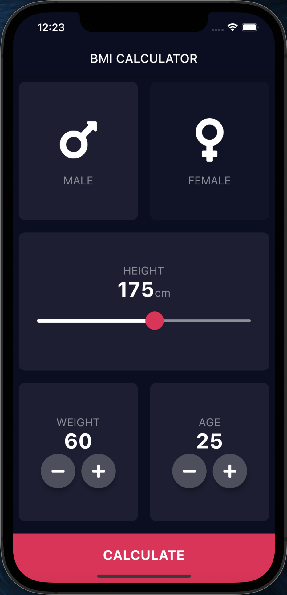
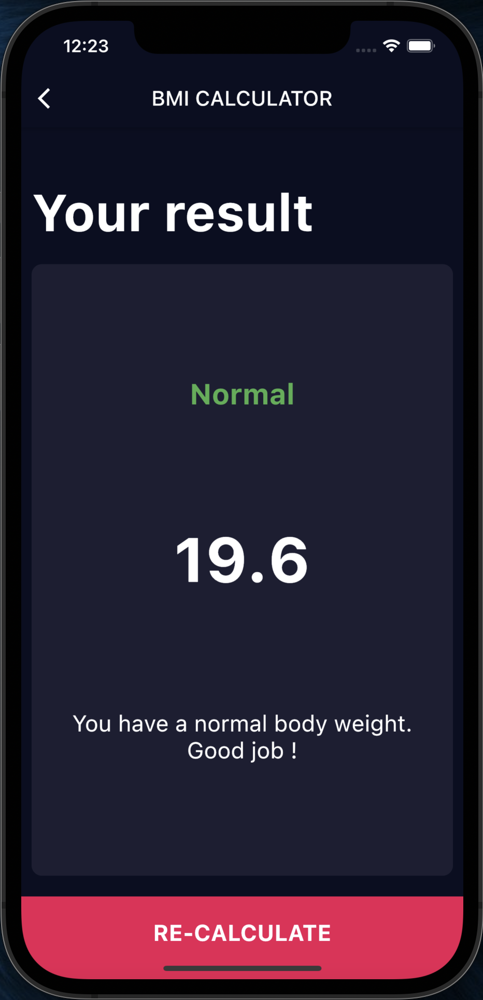

# BMI Calculator

A simple BMI calculator application realized with Flutter.

This app comes from Angela YU's tutorial : [Flutter Development Bootcamp with Dart](https://www.udemy.com/course/flutter-bootcamp-with-dart/)

 
